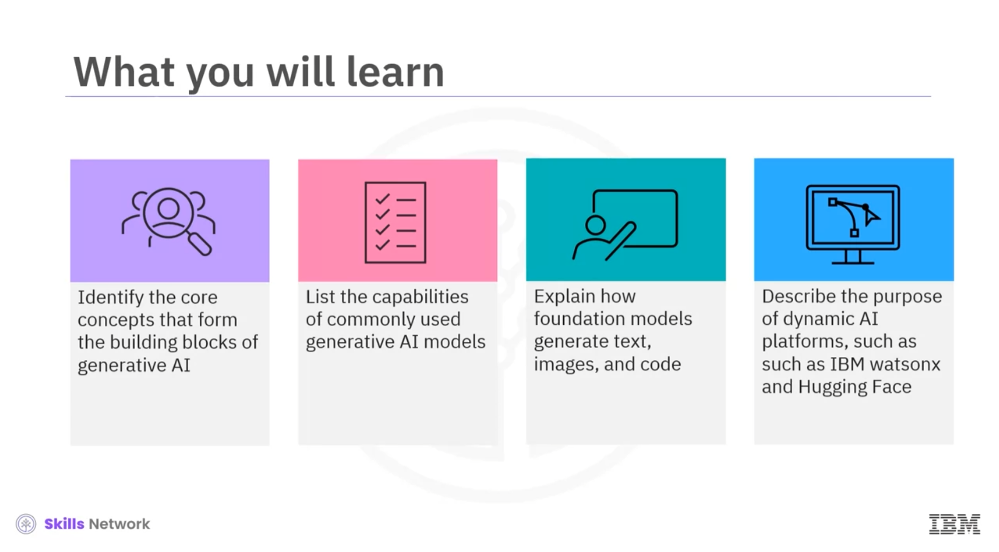
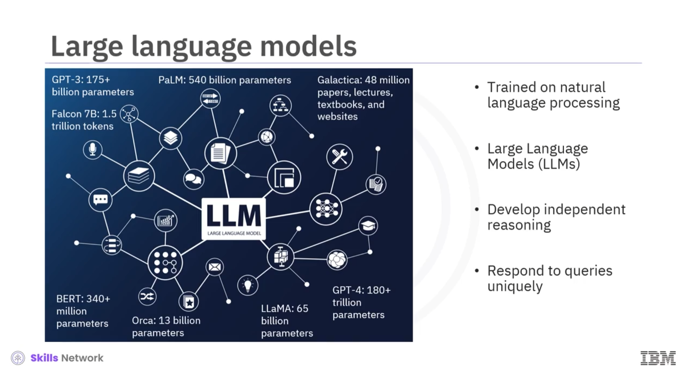

# Generative AI: Foundation Models and Platforms

The knowledge base contanis a specialization overview from the course [Generative AI: Foundation Models and Platforms](https://www.coursera.org/learn/generative-ai-foundation-models-and-platforms/) by [IBM](https://www.ibm.com/us-en) on [Coursera](https://www.coursera.org/). It is divided into following modules:
- [Core Concepts and Models of Generative AI](modules/Core%20Concepts%20and%20Models%20of%20Generative%20AI.md)
- [Pre-trained Models and Platforms for AI Applications Development](modules/Pre-trainedModelsandPlatformsforAIApplicationsDevelopment.md)

## Glossary
Following alphabetized glossary contains the names and definitions of specialized terms used across this course. Identifying and describing these terms is essential to help you comprehend the concepts covered in the course effectively.

| Term                                     | Definition                                                                                                                                                                                        |
|------------------------------------------|--------------------------------------------------------------------------------------------------------------------------------------------------------------------------------------------------|
| Artificial neural networks (ANNs)         | A collection of smaller computing units called neurons which are modeled in a manner similar to how a human brain processes information.                                                          |
| Bidirectional autoregressive transformer model (BART) | A text-to-text transfer transformer model developed by Facebook AI with a seq2seq translation architecture with bidirectional encoder representation like BERT and a left-to-right decoder like GPT. |
| Bidirectional encoder representations from transformers (BERT) | A family of language models by Google that uses pre-training and fine-tuning to create models that can accomplish several tasks.                                                                   |
| Chatbot                                  | A computer program that simulates human conversation with an end user. Though not all chatbots are equipped with artificial intelligence (AI), modern chatbots increasingly use conversational AI techniques like natural language processing (NLP) to make sense of the user's questions and automate their responses. |
| Clustering                               | An application of unsupervised learning wherein the algorithms group similar instances together based on their inherent properties.                                                                 |
| Code2Seq                                 | A text-to-code seq2seq model developed by OpenAI trained on a substantial text and code data set. It leverages the syntactic structure of programming languages to encode source code.               |
| CodeT5                                  | A text-to-code seq2seq model developed by Google AI trained on a large data set of text and code. CodeT5 is the first pre-trained programming language model that is code-aware and encoder-decoder based.                                                     |
| Convolutional neural networks (CNNs)    | Deep learning architecture networks that contain a series of layers, each conducting a convolution or mathematical operation on a previous layer.                                                     |
| DALL-E                                   | A text-to-image generation model developed by OpenAI that is trained on a large data set of text and images and can be used to generate realistic images from various text descriptions.                                                            |
| Deep learning                            | A type of machine learning focused on training computers to perform tasks through learning from data. It uses artificial neural networks.                                                            |
| Diffusion model                          | A type of generative model that is popularly used for generating high-quality samples and performing various tasks, including image synthesis. It is trained by gradually adding noise to an image and then learning to remove the noise. This process is called diffusion. |
| Dimensionality reduction                 | An application of unsupervised learning wherein the algorithms capture the most essential data features while discarding redundant or less informative ones.                                          |
| Falcon                                   | A large language model developed by the Technology Institute of Innovation (TII). Its variant, falcon-7b-instruct, is a 7-billion-parameter model based on the decoder-only model.                                                        |
| Foundational models                      | AI models with broad capabilities that can be adapted to create more specialized models or tools for specific use cases.                                                                         |
| Generative adversarial network (GAN)     | A type of generative model that includes two neural networks: Generator and discriminator. The generator is trained on vast data sets to create samples like text and images. The discriminator tries to distinguish whether the sample is real or fake.                                       |
| Generative AI models                     | Models that can understand the context of input content to generate new content. In general, they are used for automated content creation and interactive communication.                                                                        |
| Generative pre-trained transformer (GPT) | A series of large language models developed by OpenAI designed to understand language by leveraging a combination of two concepts: Training and transformers.                                             |
| Google flan                              | An encoder-decoder foundation model based on the T5 architecture.                                                                                                                                 |
| Google JAX                               | A machine learning framework used for transforming numerical functions that combines autograd (automatic obtaining of the gradient function through differentiation of a function) as well as TensorFlow's XLA (accelerated linear algebra).                                           |
| Hugging Face                             | An AI platform that allows open-source scientists, entrepreneurs, developers, and individuals to collaborate and build personalized machine learning tools and models.                                                           |
| IBM Granite                               | Multi-size foundation models that are specially designed for businesses. These models use a decoder architecture to apply generative AI to both language and code.                                                                    |
| IBM watsonx                              | An integrated AI and data platform with a set of AI assistants designed to scale and accelerate the impact of AI with trusted data across businesses.                                                                      |
| Imagen                                   | A text-to-image generation model developed by Google AI trained on a large data set of text and images. Imagen is used to generate realistic images from various text descriptions.                                                      |
| Large language models (LLMs)             | A deep learning model trained on substantial text data to learn the patterns and structures of language. They can perform language-related tasks, including text generation, translation, summarization, sentiment analysis, and more.                              |
| Llama                                    | A large language model from Meta AI.                                                                                                                                                              |
| Natural language processing (NLP)        | A subset of artificial intelligence that enables computers to understand, manipulate, and generate human language (natural language).                                                               |
| Neural code generation                   | A process that uses artificial neural networks like neural networks work in the human brain.                                                                                                   |
| Neural network model                     | A type of text-to-text generation model that uses artificial neural networks to generate text.                                                                                               |
| Neural networks                          | Computational models inspired by the human brain's structure and functioning. They are a fundamental component of deep learning and artificial intelligence.                                            |
| Open lakehouse architecture              | A data lakehouse architecture that combines elements of data lakes and data warehouses.                                                                                                       |
| PanGu-Coder                              | A text-to-code transformer model developed by Microsoft Research. It is a pre-trained decoder-only language model that generates code from natural language descriptions.                                                               |
| Pre-trained models                        | A machine learning model trained on an extensive data set before being fine-tuned or adapted for a specific task or application. These models are a type of transfer learning where the knowledge gained from one task (the pre-training task) is leveraged to perform another task (the fine-tuning task).                               |
| Pre-training                              | A technique in which unsupervised algorithms are repeatedly given the liberty to make connections between diverse pieces of information.                                                          |
| Prompt                                   | An instruction or question given to a generative AI model to generate new content.                                                                                                              |
| PyTorch                                  | An open-source machine learning framework based on the Torch library. This framework is used for applications such as computer vision and natural language processing.                                                               |
| Recurrent neural networks (RNNs)         | Deep learning architecture designed to handle sequences of data by maintaining hidden states that capture information from previous steps in the sequence.                                             |
| Seq2seq model                            | A text-to-text generation model that first encodes the input text into a sequence of numbers and then decodes this sequence into a new one, representing the generated text.                                                                        |
| Statistical model                        | A type of text-to-text generation model that uses statistical techniques to generate text.                                                                                                   |
| Supervised learning                      | A subset of AI and machine learning that uses labeled data sets to train algorithms to classify data or predict outcomes accurately.                                                            |
| T5                                       | A text-to-text transfer transformer model developed by Google AI trained on a substantial data set of code and text. It can be used for various tasks, including summarization, translation, and question-answering.                                       |
| TensorFlow                               | A free and open-source software library used for machine learning and artificial intelligence.                                                                                                |
| Text-to-code generation model             | A type of machine learning model used to generate code from natural language descriptions. It uses generative AI to write code through neural code generation.                                                                    |
| Text-to-image generation model           | A type of machine learning model used to generate images from text descriptions. It uses generative AI to make meaning out of words and turn them into unique images.                                                            |
| Text-to-text generation model             | A type of machine learning model used to generate text from a given input. It is trained on a large text corpus and is taught to learn patterns, grammar, and causal information. Using the given input, the models generate the new text.                                                |
| Training data                             | Data (generally, large data sets that also have examples) used to teach a machine learning model.                                                                                                |
| Transformers                             | A deep learning architecture that uses an encoder-decoder mechanism. Transformers can generate coherent and contextually relevant text.                                                           |
| Unsupervised learning                     | A subset of machine learning and artificial intelligence that uses algorithms based on machine learning to analyze and cluster unlabeled data sets. These algorithms can discover hidden patterns or data groupings without human intervention.                                       |
| Variational autoencoder (VAE)            | A generative model that is a neural network model designed to learn the efficient representation of input data by encoding it into a smaller space and decoding it back to the original space.                                                         |
| watsonx.ai                               | A studio of integrated tools for working with generative AI capabilities powered by foundational models and building machine learning models.                                                      |
| watsonx.data                             | A massive, curated data repository that can be used to train and fine-tune models with a state-of-the-art data management system.                                                                |
| watsonx.governance                       | A powerful toolkit to direct, manage, and monitor your organization's AI activities.                                                                                                           |

## Specialization Overview
###  Generative AI for Everyone specialization
This [Generative AI Fundamentals Specialization](https://www.coursera.org/specializations/generative-ai-for-everyone) provides a comprehensive understanding of the fundamental concepts, models, tools, and applications of Generative AI, empowering you to apply and unlock its possibilities. 

In this specialization, you will explore the capabilities and applications of Generative AI. You will learn about the building blocks and foundation models of Generative AI. You will explore Generative AI tools and platforms for diverse use cases. Additionally, you will learn about prompt engineering, enabling you to optimize the outcomes produced by Generative AI tools. Further, you will gain an understanding of the ethical implications of Generative AI in relation to data privacy, security, the workforce, and the environment. Finally, the specialization will help to recognize the potential career implications and opportunities through Generative AI. 

This specialization is intended for:
- Working professionals who want to enhance their careers by leveraging the power of generative AI
- Technophiles who wish to stay updated with the advancements in AI
- Individuals seeking an introduction to generative AI and a seamless experience through the world of Generative AI
- Managers and executives who want to leverage generative AI in their organizations
- Students who wish to graduate with practical AI skills that will enhance their job-readiness

### Specialization Content

The Generative AI for Everyone specialization comprises five short courses.
- Course 1: Generative AI: Introduction and Applications
- Course 2: Generative AI: Prompt Engineering Basics
- **Course 3: Generative AI: Foundation Models and Platforms**
- Course 4: Generative AI: Impact, Considerations, and Ethical Issues
- Course 5: Generative AI: Future and Career Growth

Most of the content is from the course itself. © IBM Corporation 2023.