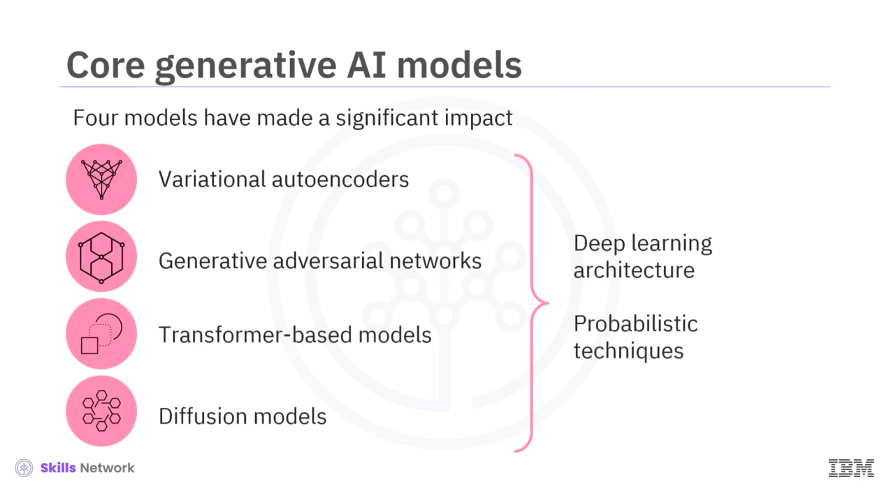
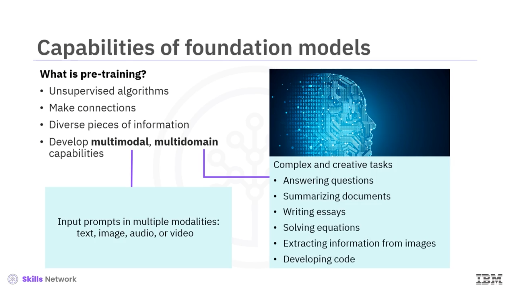

# Core Concepts and Models of Generative AI

This summary presents the core concepts of generative AI, such as deep learning and large language models (LLMs). Here, the generative AI models like VAE, GANs, transformers, and diffusion models are discussed. As a result, there is insight into how these foundation models form the building blocks of generative AI models and how we could use them to generate content.

Following is the summary:
- The core concepts of generative AI, like large language models, can perform human-like tasks. 
- LLMs leverage the power of transformer networks to pre-train deep learning algorithms on vast data sets.  
- While these algorithms capture patterns and hierarchies within data sets to generate accurate human-like responses, this technology makes generative AI scalable.
- The core generative AI models serve as the building blocks of generative AI and offer distinctive features.
- The four core building blocks of generative AI models include:
    - **Variational autoencoders** that rapidly reduce the dimensionality of samples.
    - **Generative adversarial** networks use competing networks to produce realistic samples.  
    - **Transformer-based models** use attention mechanisms to model long-term text dependencies.
    - **Diffusion models** address information decay by removing noise in the latent space.  

- The foundation models are pre-trained on billions of parameters, which allows them to develop independent reasoning and execute a large variety of complex tasks.  
- The foundation models can be the foundation or base for generative AI applications, given their multimodal and multidomain capabilities.

