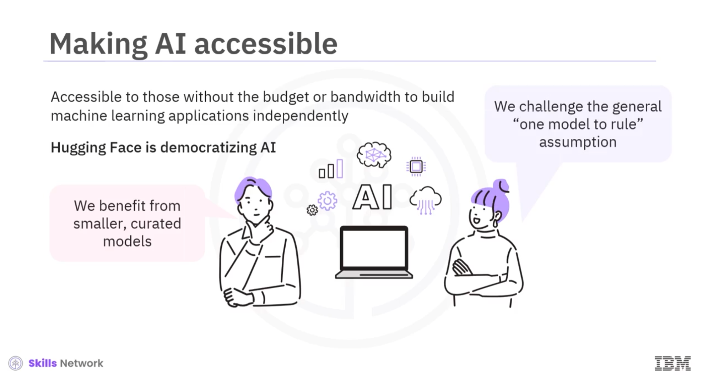
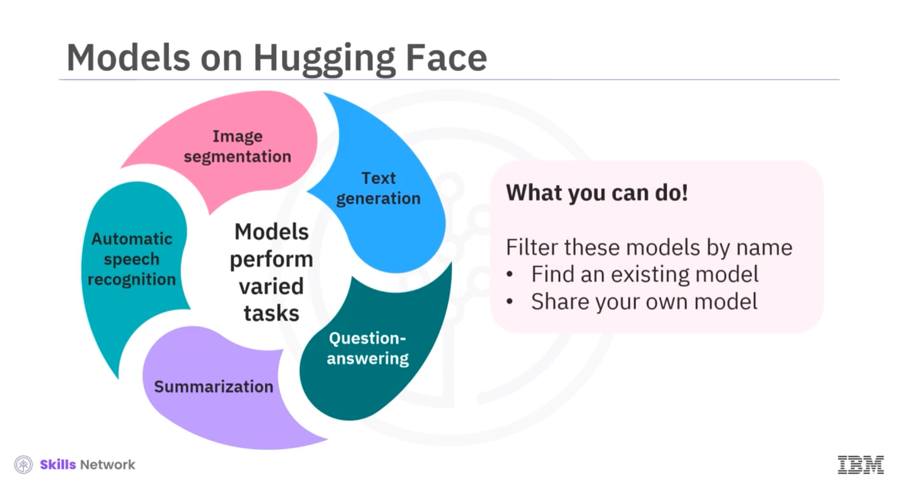

# Pre-trained Models and Platforms for AI Applications Development

This section talks about the pre-trained models and platforms used for generative AI application development.

The ability of foundation models to generate text, images, and code using pre-trained models is discussed. The features and capabilities of different platforms, including IBM watsonx and Hugging Face are mentioned.

Following is the summary:

- Text-to-text generation models are a type of machine learning model used to generate text from a given input.
- There are two types of text-to-text generation models: statistical and neural networks. Further, these models use seq2seq or transformer type of models.
- The most popular text-to-text generation models are GPT, T5, and BART.
- Text-to-text generation models increase the efficiency of tasks like writing scripts, musical pieces, emails, letters, and so on.
- Text-to-image generation models generate images from text descriptions. They make meaning out of your words and turn them into unique images.
- These models are classified into two types: GANs and diffusion models. The most popular text-to-image generation models are DALL-E and Imagen.
- Text-to-image generation models can generate various types of realistic or abstract images.
- Text-to-code generation models are a type of machine learning model used to generate code from natural language descriptions.
- There are two types of text-to-code generation models: Seq2Seq and transformer. The most popular models within this classification are CodeT5, Code2Seq, and PanGu-Coder.
- Text-to-code generation models use automatic coding, which is more efficient, accurate, and consistent than manual coding.
- IBM watsonx is an AI and data platform that helps businesses create AI responsibly and with transparency. It is a family of three products: watsonx.ai, watsonx.data, and watsonx.governance. 
- With its three products, IBM watsonx can multiply the impact of AI across businesses.
- Hugging Face is an open-source AI platform where scientists, entrepreneurs, developers, and individuals collaborate to build personalized machine learning tools and models at a reduced cost, in an accelerated timeframe, and with a lower carbon footprint.  

